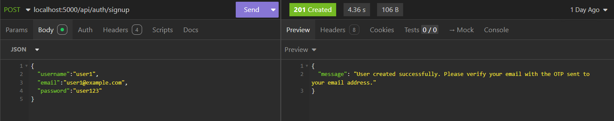
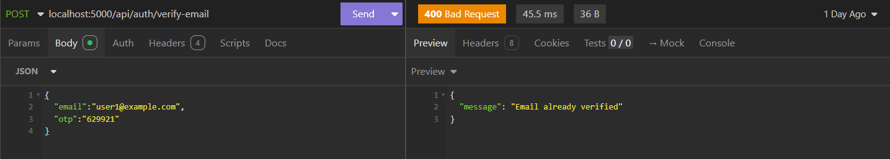
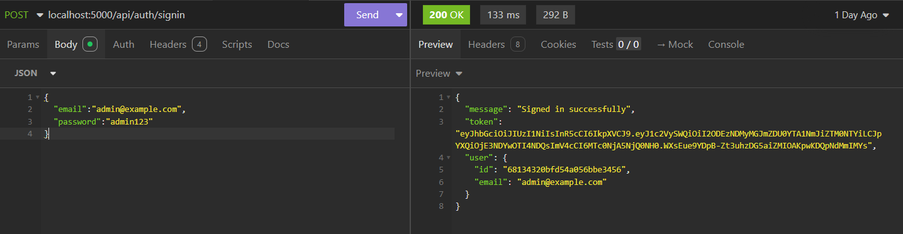
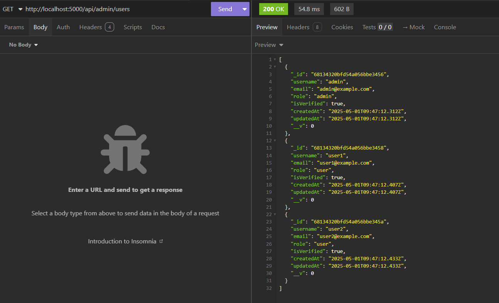
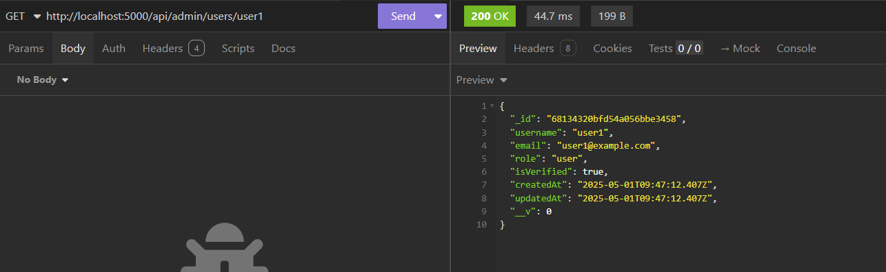
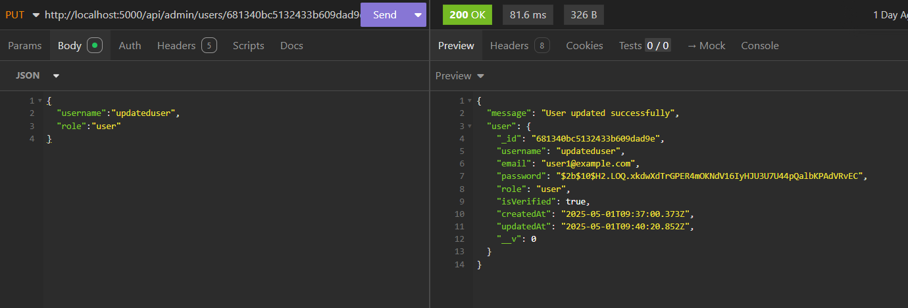
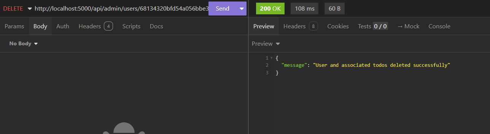
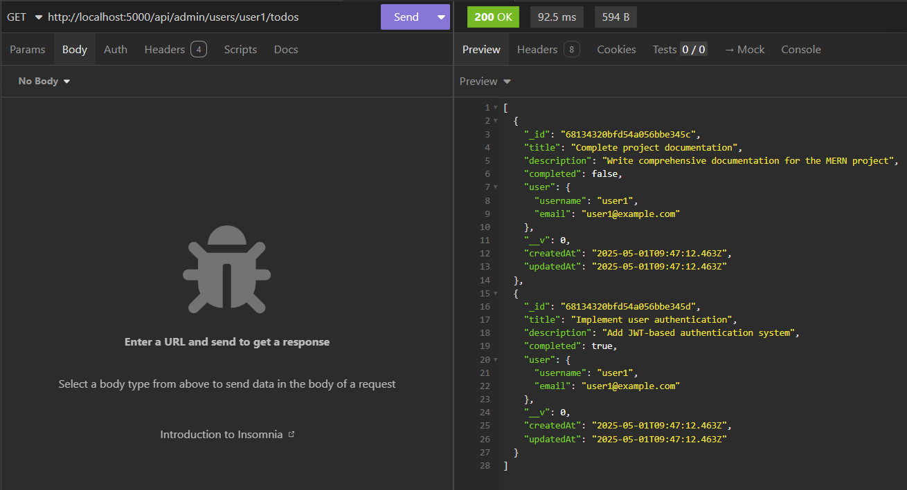

# Todo MERN Application

A full-stack Todo application with user authentication, email verification, and admin features.

## Features

- User authentication (signup/signin)
- Email verification with OTP
- Todo management (CRUD operations)
- Admin panel for user management
- Role-based access control
- API documentation with Swagger

## Prerequisites

- Node.js (v14 or higher)
- MongoDB
- npm or yarn

## Setup Instructions

1. Clone the repository

2. Install dependencies:
```bash
npm install
```

3. Create a `.env` file in the root directory and add the following environment variables:
```
PORT=3000
MONGODB_URI=<your_mongodb_uri>
JWT_SECRET=<your_jwt_secret>
```

4. Seed the database with test data:
```bash
npm run seed
```

5. Start the development server:
```bash
npm run dev
```

## Setup Instructions (Docker)

1. Clone the repository

2. Create a `.env` file in the root directory and add the following environment variables:
```
PORT=5000
MONGODB_URI=<your_mongodb_uri>
JWT_SECRET=your_jwt_secret_key
```

3. Build and run the Docker containers:
```bash
docker compose up --build
```

4. In a new terminal, seed the database with test data:
```bash
docker compose exec app npm run seed
```

5. The application should now be running at `localhost:5000`.

## API Documentation

### Authentication Routes

#### 1. Sign Up
**Endpoint:** `POST /api/auth/signup`

This endpoint creates a new user account. Upon successful registration, an OTP is sent to the user's email for verification.

#### 2. Verify Email
**Endpoint:** `POST /api/auth/verify-email`

Verifies the user's email using the OTP sent during registration. The OTP expires after 10 minutes.

#### 3. Sign In
**Endpoint:** `POST /api/auth/signin`

Authenticate user and receive a JWT token for accessing protected routes.

### Admin Routes

#### 1. Get All Users
**Endpoint:** `GET /api/admin/users`
**Headers:** `Authorization: Bearer <admin_jwt_token>`

Retrieve a list of all registered users. Sensitive information like passwords and OTPs are excluded.

#### 2. Get User by Username
**Endpoint:** `GET /api/admin/users/:username`
**Headers:** `Authorization: Bearer <admin_jwt_token>`

Retrieve details of a specific user by their username.

#### 3. Update User by ID
**Endpoint:** `PUT /api/admin/users/:id`
**Headers:** `Authorization: Bearer <admin_jwt_token>`

Update the role of a user. Only admin users can perform this action.

#### 4. Delete User by ID
**Endpoint:** `DELETE /api/admin/users/:id`
**Headers:** `Authorization: Bearer <admin_jwt_token>`

Delete a user by their ID. Only admin users can perform this action.

#### 5. Get User's Todos
**Endpoint:** `GET /api/admin/users/:username/todos`
**Headers:** `Authorization: Bearer <admin_jwt_token>`

Retrieve a list of todos associated with a specific user.